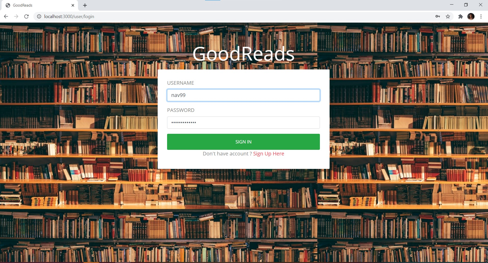
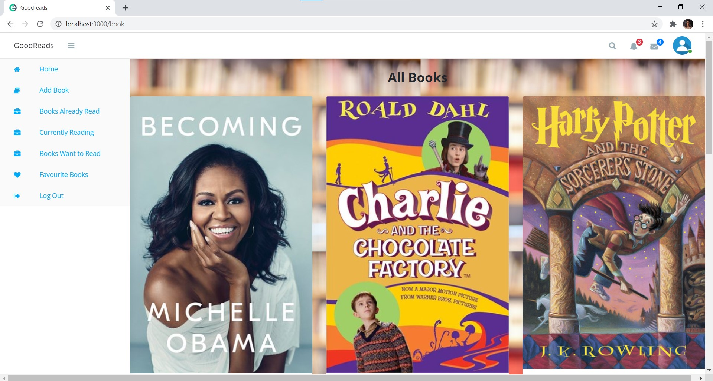
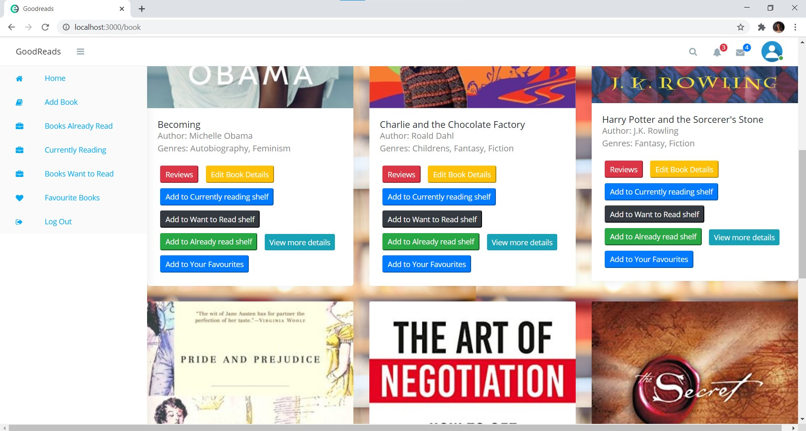
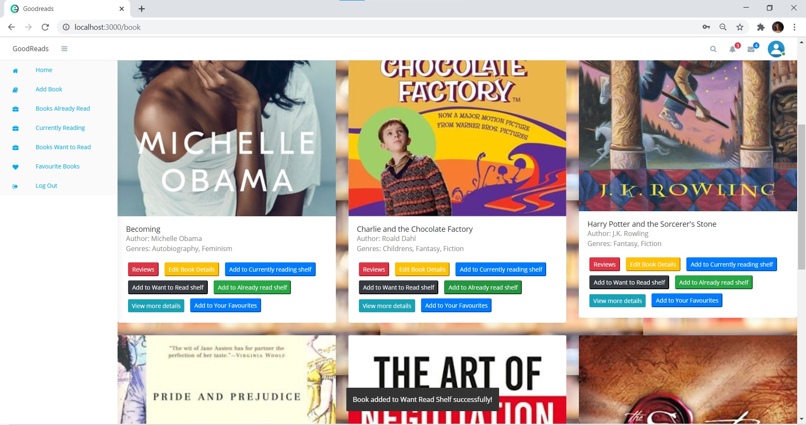

# ADBMS-Project
Mini Goodreads

We have developed a clone of GoodReads, an application that helps to organize our reading habits. The project gave us a chance to successfully implement various functionalities in [MongoDB](./mini-goodreads-mongo) and [PostgreSQL](./mini-goodreads-postgres) using Node.js as the backend and EJS for frontend. In the databases, we implemented operations like Insert, Delete, Update and various Joins. We then established connections between the backend and the database for these operations. We also established the connection between client and backend to allow the user to perform operations like 

- Login
- Sign up
- Add a new book to the catalogue
- Edit a book’s details already in the catalogue
- Add books to Currently Reading, Already Read and Want to Read - shelves
- Remove books from Currently Reading, Already Read and Want to Read shelves
- Add books to your own Favourites
- Remove books to your own Favourites
- See all reviews of a book
- Add reviews for a book including star ratings
- Edit your reviews
- Delete your reviews
- Check out your profile details which also has a list of all reviews done by you

## UI 

Signup:

Login:

Homepage:

Add Book:

Edit Book:

View All Reviews:

Add Review:

Add to shelf notification:

Shelves:

- Currently Reading

- Read

- Want to Read

Profile Page:

